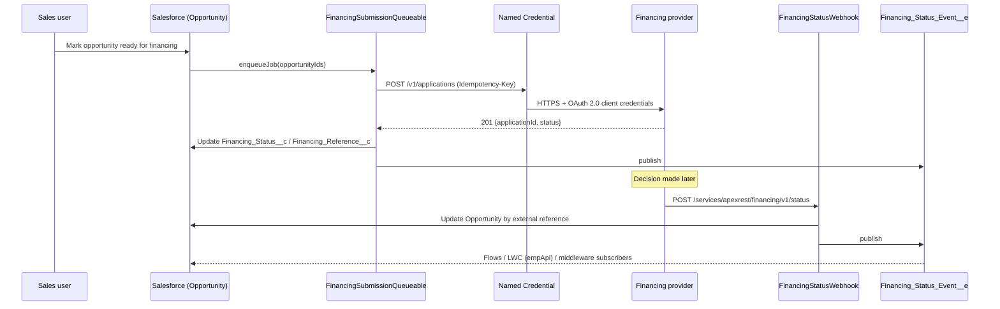

# Salesforce Integration Patterns

Outbound and inbound integration patterns for Salesforce: a Named Credential REST client with retries and idempotency, Queueable callouts, an Apex REST webhook, and Platform Events – with a runnable mock provider API.

> **Representative portfolio project.** Written independently with synthetic data to demonstrate integration techniques. It is not code from, and does not describe the systems of, any employer or client. The "financing provider" is fictional.

## Business problem

A sales team closes residential energy deals in Salesforce, but loan applications are decided by an external financing provider. The business needs to:

1. Submit applications from Opportunities without making users wait on a third-party API.
2. Survive provider outages without creating duplicate applications.
3. Receive decisions back in real time and notify downstream processes (Flows, portals, middleware).

## What it demonstrates

| Pattern | Implementation |
|---|---|
| Credentials outside code | `callout:Financing_API` Named Credential + External Credential ([setup](docs/named-credential-setup.md)) |
| Idempotent requests | `Idempotency-Key` header = Opportunity Id; provider returns the original application on repeats |
| Bounded retries for transient errors | `FinancingApiClient.sendWithRetry` – retries 429/5xx and timeouts, fails fast on 4xx |
| Callouts off the user transaction | `FinancingSubmissionQueueable` (`Database.AllowsCallouts`), chunked and self-chaining |
| Inbound webhook with validation | `FinancingStatusWebhook` (`@RestResource`) – 400 / 404 / 422 handling, strict JSON |
| Event-driven notification | `Financing_Status_Event__e` Platform Event, *publish after commit* |
| Central status mapping | `FinancingStatusMapper` |
| Testable callouts | `FinancingApiMock` – scripted responses, including timeouts |
| Contract-tested mock provider | `mock-server/` (Node, no dependencies) with 9 tests |

## Architecture



## Tech stack

Apex · HttpCalloutMock · Named & External Credentials · Apex REST · Platform Events · Queueable Apex · Node.js 20 (mock API, `node:test`) · Docker · GitHub Actions

## Run the mock provider locally

```bash
npm run start:mock                  # http://localhost:4010
curl -s -X POST localhost:4010/v1/applications \
  -H 'Content-Type: application/json' -H 'Idempotency-Key: demo-1' \
  -d '{"externalId":"demo-1","systemPrice":32000,"termMonths":240,"postalCode":"75009"}'
# {"applicationId":"APP-1001","status":"SUBMITTED","message":"Application received"}

npm run test:mock                   # 9 contract tests
docker build -t financing-mock mock-server && docker run -p 4010:4010 financing-mock
```

Add `-H 'X-Mock-Fail: 503'` to any request to see a transient failure.

## Deploy to a scratch org

```bash
npm install
sf org login web --set-default-dev-hub --alias devhub
sf org create scratch --definition-file config/project-scratch-def.json --alias integration-demo --set-default
sf project deploy start
npm run test:apex
```

Then create the Named Credential as described in [docs/named-credential-setup.md](docs/named-credential-setup.md). Submit records from Anonymous Apex:

```apex
System.enqueueJob(new FinancingSubmissionQueueable(
    new List<Id>(new Map<Id, Opportunity>([SELECT Id FROM Opportunity LIMIT 10]).keySet())));
```

## Tests

| Class | Scenarios |
|---|---|
| `FinancingApiClientTest` | success, idempotency header, retry after 503 + timeout, fail-fast on 400, give up after max attempts, status mapping |
| `FinancingSubmissionQueueableTest` | stores reference, marks errors without failing the job, skips already-decided records |
| `FinancingStatusWebhookTest` | valid update, malformed JSON (400), unknown status (422), unknown application (404) |
| `mock-server/test` | 9 HTTP contract tests (runs in CI without an org) |

## Security considerations

- No endpoints, client IDs or secrets in the repository; authentication is configured in the org's External Credential and granted to the integration user through a permission set.
- Webhook runs `with sharing`, uses user-mode SOQL/DML, validates input with `JSON.deserializeStrict`, and returns no internal details in error responses.
- The mock server has no authentication and is for local use only.
- CI runs a Gitleaks secret scan on every push.

## Limitations and future enhancements

- Retries happen within one transaction; a production design might re-enqueue with back-off (or use a MuleSoft/event-driven retry queue) for longer outages.
- The webhook trusts OAuth for caller identity; adding HMAC signature verification would add defense in depth.
- Future: MuleSoft (System/Process API) variant of the same flow, Change Data Capture trigger, LWC status component subscribed via `lightning/empApi`.

## License

MIT – see [LICENSE](LICENSE).
